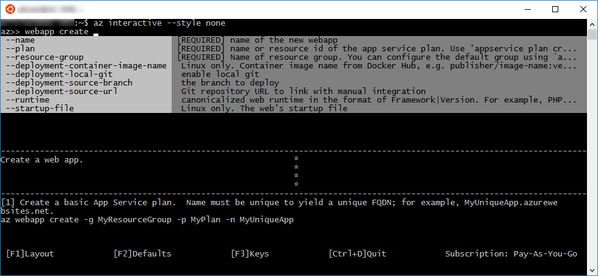

# <a name="azure-cli-interactive-mode"></a><span data-ttu-id="06b3c-103">Mode interactif d’Azure CLI</span><span class="sxs-lookup"><span data-stu-id="06b3c-103">Azure CLI interactive mode</span></span>

<span data-ttu-id="06b3c-104">Vous pouvez utiliser Azure CLI en mode interactif en exécutant la commande `az interactive`.</span><span class="sxs-lookup"><span data-stu-id="06b3c-104">You can use Azure CLI in interactive mode by running the `az interactive` command.</span></span>
<span data-ttu-id="06b3c-105">Ce mode vous place dans un interpréteur de commandes interactif avec une saisie semi-automatique, des descriptions des commandes ainsi que des exemples.</span><span class="sxs-lookup"><span data-stu-id="06b3c-105">This mode places you in an interactive shell with auto-completion, command descriptions, and examples.</span></span>



> [!NOTE]
> <span data-ttu-id="06b3c-107">Ici, nous n’utilisons pas le style par défaut, qui ne se lit pas aussi bien sur un arrière-plan noir.</span><span class="sxs-lookup"><span data-stu-id="06b3c-107">We're not using the default style here, which doesn't read as well on a black background.</span></span>

<span data-ttu-id="06b3c-108">Si vous n’êtes pas déjà connecté à votre compte, utilisez la commande `login`.</span><span class="sxs-lookup"><span data-stu-id="06b3c-108">If you're not already signed in to your account, use the `login` command.</span></span>

## <a name="configure"></a><span data-ttu-id="06b3c-109">Configuration</span><span class="sxs-lookup"><span data-stu-id="06b3c-109">Configure</span></span>

<span data-ttu-id="06b3c-110">Le mode interactif affiche, si vous le souhaitez, des descriptions des commandes, des descriptions des paramètres et des exemples de commandes.</span><span class="sxs-lookup"><span data-stu-id="06b3c-110">Interactive mode optionally displays command descriptions, parameter descriptions, and command examples.</span></span>
<span data-ttu-id="06b3c-111">Activez ou désactivez les descriptions et les exemples à l’aide de `F1`.</span><span class="sxs-lookup"><span data-stu-id="06b3c-111">Turn descriptions and examples on or off using `F1`.</span></span>


<span data-ttu-id="06b3c-113">Vous pouvez activer ou désactiver l’affichage des valeurs par défaut des paramètres à l’aide de `F2`.</span><span class="sxs-lookup"><span data-stu-id="06b3c-113">You can turn the display of parameter defaults on or off using `F2`.</span></span>


<span data-ttu-id="06b3c-115">`F3` active ou désactive l’affichage de certains mouvements clés.</span><span class="sxs-lookup"><span data-stu-id="06b3c-115">`F3` toggles the display of some key gestures.</span></span>


## <a name="scope"></a><span data-ttu-id="06b3c-117">Étendue</span><span class="sxs-lookup"><span data-stu-id="06b3c-117">Scope</span></span>

<span data-ttu-id="06b3c-118">Vous pouvez étendre votre mode interactif à un groupe de commandes spécifique comme `vm` ou `vm image`.</span><span class="sxs-lookup"><span data-stu-id="06b3c-118">You can scope your interactive mode to a specific command group like `vm` or `vm image`.</span></span>
<span data-ttu-id="06b3c-119">Dans ce cas, toutes les commandes sont interprétées dans le cadre de cette étendue.</span><span class="sxs-lookup"><span data-stu-id="06b3c-119">When you do, all commands are interpreted in that scope.</span></span>
<span data-ttu-id="06b3c-120">Il s’agit d’un raccourci pratique si vous effectuez tout votre travail dans ce groupe de commandes.</span><span class="sxs-lookup"><span data-stu-id="06b3c-120">It's a great shorthand if you're doing all your work in that command group.</span></span>

<span data-ttu-id="06b3c-121">Au lieu de taper les commandes suivantes :</span><span class="sxs-lookup"><span data-stu-id="06b3c-121">Instead of typing these commands:</span></span>

```azurecli
az>> vm create -n myVM -g myRG --image UbuntuLTS
az>> vm list -o table
```

<span data-ttu-id="06b3c-122">Vous pouvez définir l’étendue au groupe de commandes de la machine virtuelle et taper les commandes suivantes :</span><span class="sxs-lookup"><span data-stu-id="06b3c-122">You can scope to the vm command group and type these commands:</span></span>

```azurecli
az>> %%vm
az vm>> create -n myVM -g myRG --image UbuntuLTS
az vm>>list -o table
```

<span data-ttu-id="06b3c-123">Vous pouvez également définir l’étendue pour des groupes de commandes de niveau inférieur.</span><span class="sxs-lookup"><span data-stu-id="06b3c-123">You can scope to lower-level command groups as well.</span></span>
<span data-ttu-id="06b3c-124">Vous pouvez définir l’étendue à `vm image` à l’aide de `%%vm image`.</span><span class="sxs-lookup"><span data-stu-id="06b3c-124">You could scope to `vm image` using `%%vm image`.</span></span>
<span data-ttu-id="06b3c-125">Dans ce cas, étant donné que nous avons déjà défini l’étendue à `vm`, nous utilisons `%%image`.</span><span class="sxs-lookup"><span data-stu-id="06b3c-125">In this case, since we're already scoped to `vm`, we would use `%%image`.</span></span>

```azurecli
az vm>> %%image
az vm image>>
```

<span data-ttu-id="06b3c-126">À ce stade, nous pouvons redéfinir l’étendue sur `vm` à l’aide de `%%..`, ou nous pouvons étendre à la racine en utilisant simplement `%%`.</span><span class="sxs-lookup"><span data-stu-id="06b3c-126">At that point, we can pop the scope back up to `vm` using `%%..`, or we can scope to the root with just `%%`.</span></span>

```azurecli
az vm image>> %%
az>>
```

## <a name="query"></a><span data-ttu-id="06b3c-127">Requête</span><span class="sxs-lookup"><span data-stu-id="06b3c-127">Query</span></span>

<span data-ttu-id="06b3c-128">Vous pouvez exécuter une requête JMESPath sur les résultats de la dernière commande exécutée.</span><span class="sxs-lookup"><span data-stu-id="06b3c-128">You can execute a JMESPath query on the results of the last command that you executed.</span></span>
<span data-ttu-id="06b3c-129">Par exemple, après avoir créé une machine virtuelle, vous pouvez vous assurer qu’elle est entièrement configurée.</span><span class="sxs-lookup"><span data-stu-id="06b3c-129">For example, after you create a VM, you can make sure it has fully provisioned.</span></span>

```azurecli
az>> vm create --name myVM --resource-group myRG --image UbuntuLTS --no-wait -o json
az>> ? [*].provisioningState
```

```json
[
  "Creating"
]
```

<span data-ttu-id="06b3c-130">Pour plus d’informations concernant l’interrogation des résultats de vos commandes, consultez [Interroger les résultats d’une commande avec Azure CLI](query-azure-cli.md).</span><span class="sxs-lookup"><span data-stu-id="06b3c-130">To learn more about querying the results of your commands, see [Query command results with the Azure CLI](query-azure-cli.md).</span></span>

## <a name="bash-commands"></a><span data-ttu-id="06b3c-131">Commandes Bash</span><span class="sxs-lookup"><span data-stu-id="06b3c-131">Bash commands</span></span>

<span data-ttu-id="06b3c-132">Vous pouvez exécuter des commandes shell sans quitter le mode interactif à l’aide de `#[cmd]`.</span><span class="sxs-lookup"><span data-stu-id="06b3c-132">You can run shell commands without leaving interactive mode using `#[cmd]`.</span></span>

```azurecli
az>> #dir
```

## <a name="examples"></a><span data-ttu-id="06b3c-133">Exemples</span><span class="sxs-lookup"><span data-stu-id="06b3c-133">Examples</span></span>

<span data-ttu-id="06b3c-134">Certaines commandes comportent un grand nombre d’exemples.</span><span class="sxs-lookup"><span data-stu-id="06b3c-134">Some commands have lots of examples.</span></span>
<span data-ttu-id="06b3c-135">Vous pouvez faire défiler vers la page suivante des exemples à l’aide de `CTRL-N` et vers la page précédente à l’aide de `CTRL-Y`.</span><span class="sxs-lookup"><span data-stu-id="06b3c-135">You can scroll to the next page of examples using `CTRL-N` and the previous page using `CTRL-Y`.</span></span>


<span data-ttu-id="06b3c-137">Vous pouvez également consulter un exemple spécifique à l’aide de `::#`.</span><span class="sxs-lookup"><span data-stu-id="06b3c-137">You can also look at a specific example using `::#`.</span></span>

```azurecli
az>> vm create ::8
```
